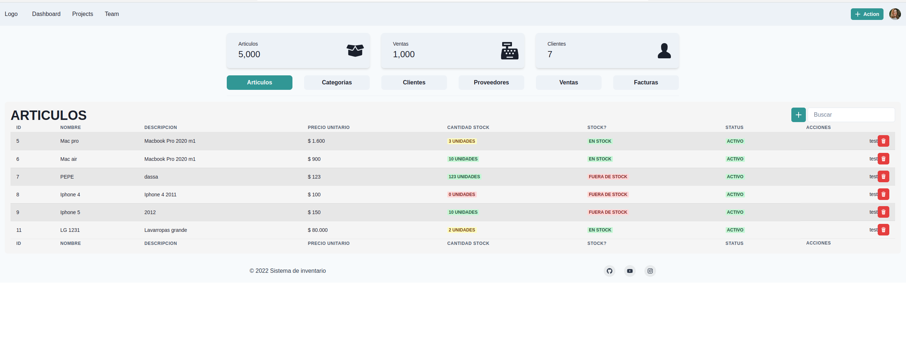

# Sistema Inventario Frontend

## Desarrollado con React.js

## Instalacion y ejecucion

1. `npm install`
2. `npm run start`

Produccion

1. `npm install`
2. `npm run build`
3. `npx serve -s ./build -p ${REACT_APP_PORT}`

BACKEND haciendo clien en el siguiente [LINK](https://github.com/ARG-sistema-inventario/ms-auth-rest)

Siéntase libre de contribuir con el proyecto.

